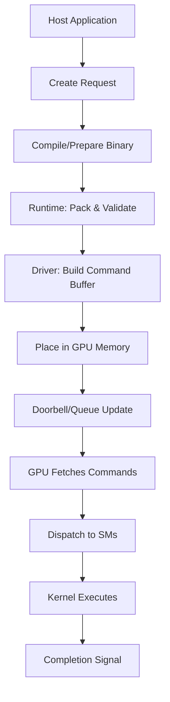

# Kernel Launch Flow: Full Picture

This note provides a high-level visualization of the path a workload takes from a high-level application request to hardware execution.

### The Step-by-Step Flow

> [!abstract] 1. Host Preparation
> - **Host Application**: Initiates the request.
> - **Create**: Define kernel request and parameters.
> - **Compile**: Prepare device code and metadata.

> [!abstract] 2. Software Driver/Runtime
> - **Runtime**: Packs arguments and validates configuration.
> - **Driver**: Builds the hardware command buffer.
> - **Memory**: Command buffer is placed in GPU-visible memory.
> - **Signaling**: Doorbell or queue tail update alerts the GPU.

> [!abstract] 3. Hardware Execution
> - **Fetch**: GPU reads commands from memory.
> - **Dispatch**: Grid is broken down into thread blocks.
> - **Schedule**: Blocks assigned to Streaming Multiprocessors (SMs).
> - **Execute**: Physical processing of kernels.
> - **Completion**: Signal (interrupt/event) sent back to host.

---

### Visual Summary

